# Afro Fashion Stable Diffusion

We are excited to introduce Afro Fashion Stable Diffusion, the inaugural version of a Stable Diffusion-based model designed explicitly for African fashion. This release is a part of the [Inclusive Fashion AI](https://github.com/hgilles06/infashai) (InFashAI) initiative, which aims to create datasets and AI models that better represent the diversity of the fashion universe. The project is dedicated to incorporating African fashion styles into cutting-edge AI technologies.
We fine-tuned the Stable Diffusion model v1.4 using an African fashion dataset, resulting in a model that generates more relevant African fashion items. This model can assist stylists, designers, and others in creative and design processes.

## Overview

We leveraged proprietary data from [Afrikrea](https://www.afrikrea.com/), one of the largest African fashion sales platforms. This database includes almost 100,000 images, with their titles and descriptions including specific African fashion attributes such as material (e.g., wax or kente) and fabric. We used this database to fine-tune the base Stable Diffusion model. [stable diffusion model](https://arxiv.org/abs/2112.10752) [v1.4](https://huggingface.co/CompVis/stable-diffusion).

## Data Curation

In the data cleaning process, all unsuitable images were removed, and a standardized set of prompts was developed to ensure consistent learning for the model across various images. This was necessary as the initial titles and descriptions were not well formatted for prompting. The revised prompts now consider attributes such as clothing type, material, fabric, color, and gender.

## Models

The fine-tuned model is capable of generating improved images of African fashion. The code utilized for fine-tuning and image generation is open-source via this repository. A minimum of 30 GB of VRAM was required for training and 8 GB of VRAM for inference.

## Results

Overall, the results from the test sample demonstrate that both the non-fine-tuned Stable Diffusion model and the various checkpoints of the fine-tuned version showed some capabilities in accounting for some African fashion specificities. However, since the fine-tuned version had access to additional attributes related to African clothing through learning from our dataset, it performs better in certain areas where the non-fine-tuned model fails to precisely adhere to the prompts. As a result, fine-tuning has proven to be beneficial (see images below). The non-fine-tuned model generates images with superior clarity and quality compared to the fine-tuned model. As it is challenging to determine the best checkpoint for the fine-tuned model, users are encouraged to test the different checkpoints to identify the one that best suits their needs. We are releasing five distinct checkpoints obtained at different training steps: `20,000`, `40,000`, `60,000`,`80,000`, and the final checkpoint. These checkpoints are contained within compressed folders labeled as `checkpoint-x.zip,` where `x` denotes the number of training steps for model fine-tuning. These checkpoints are securely stored within our drive, and you are encouraged to download them [here](https://drive.google.com/drive/u/1/folders/1cz8By6LPai5qt0NSA61UfLrWWGg98dA_). Below, we showcase some typical cases where the base Stable Diffusion model fails. For each case, we provide a reference image from our test set, followed by the images generated by the various checkpoints: 

* Example 1 : In this example, the non-finetuned model omitted cowries in the generated images:
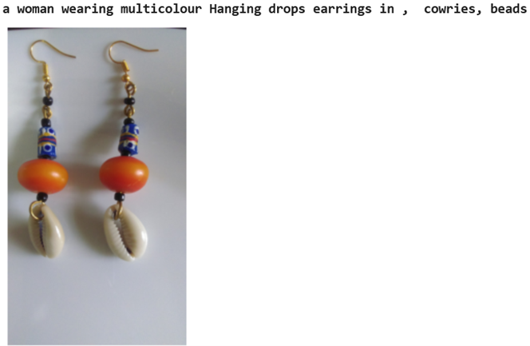
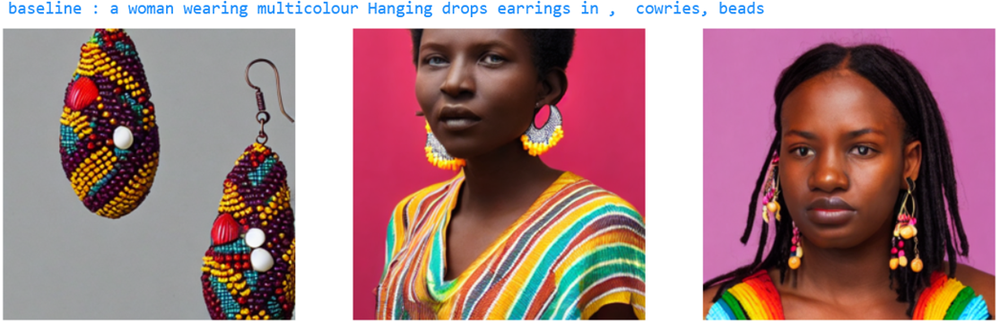
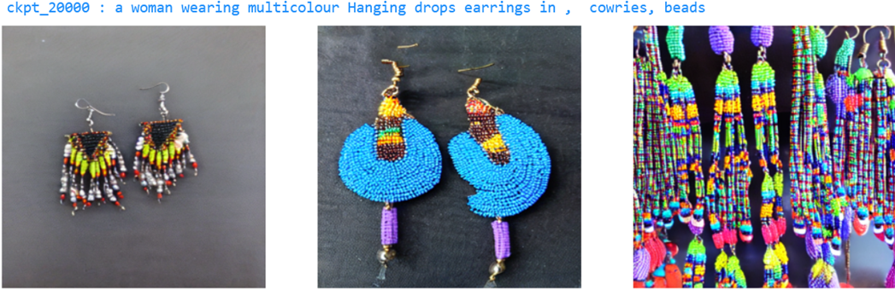
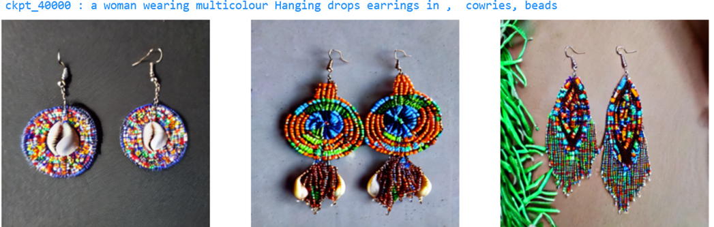
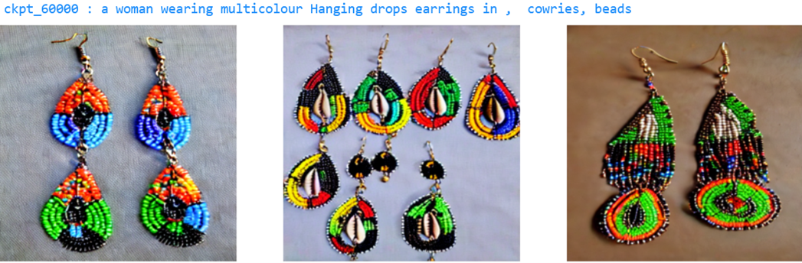
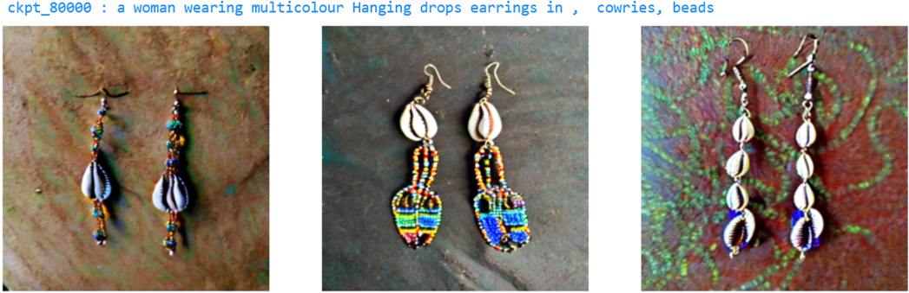
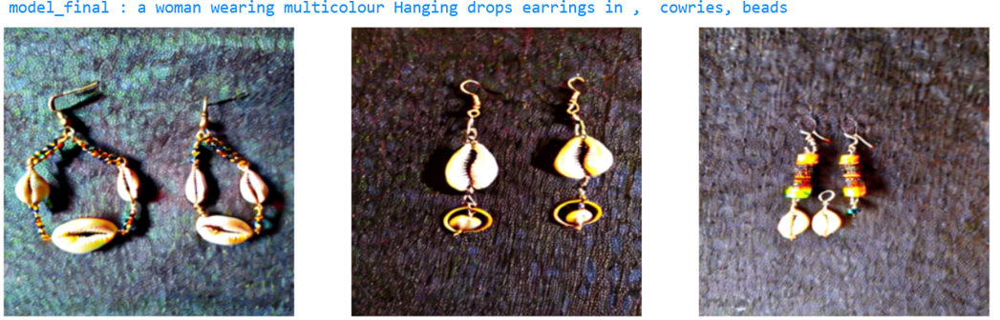
* Example 2 : Here, the non-finetuned model didn't generate a mid-length cloth for the specified fabric:
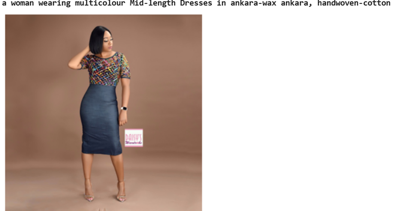
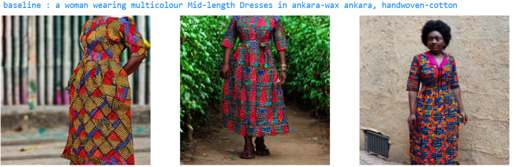

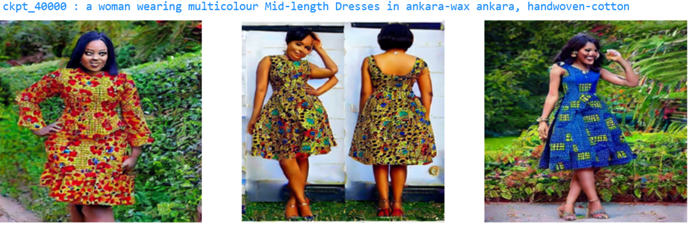
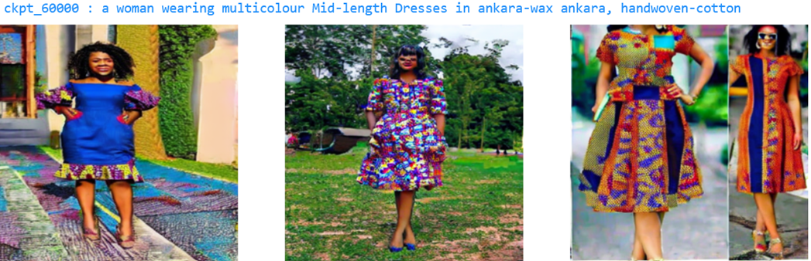
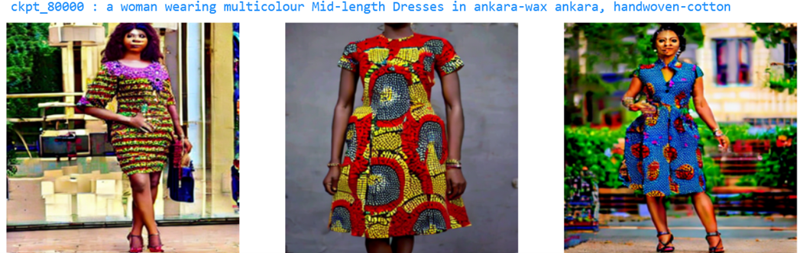
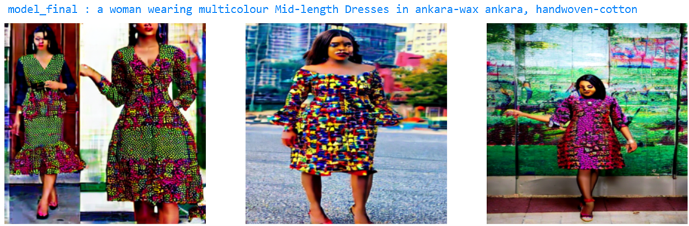
* Example 3 : For this case, the style generated by the base model is not a kente fabric

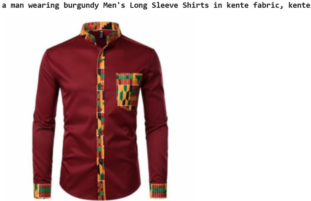
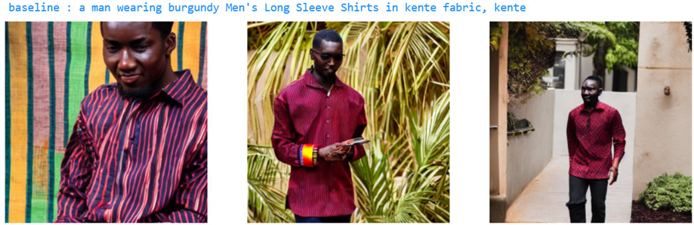
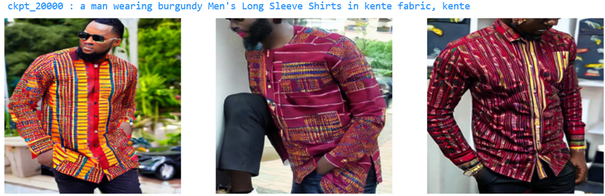

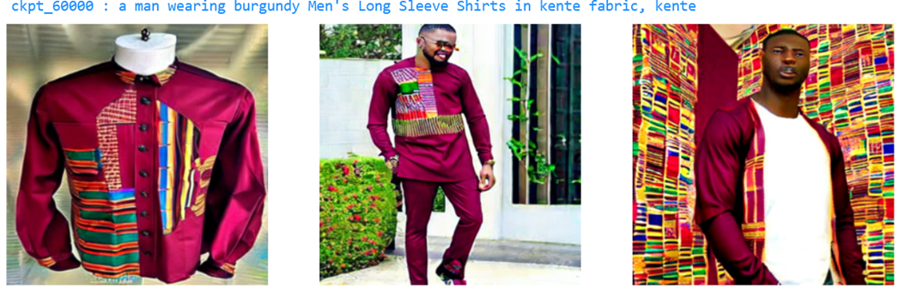
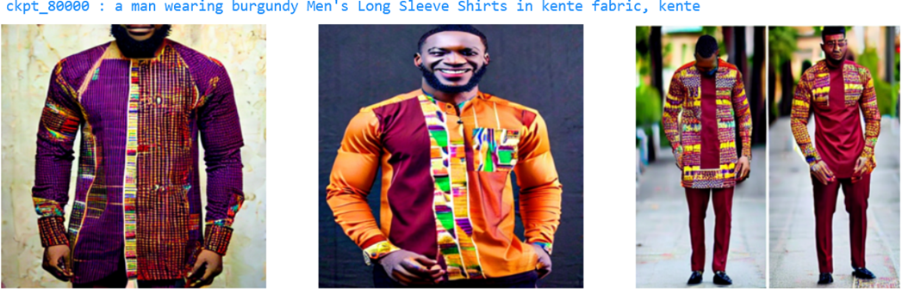
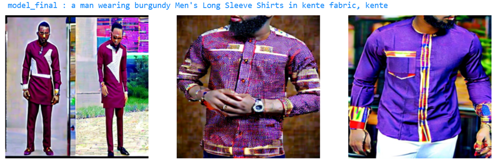
* Example 4 : Here, the base model tends to the western style as expected :
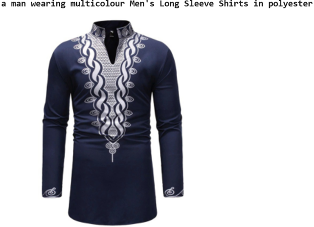
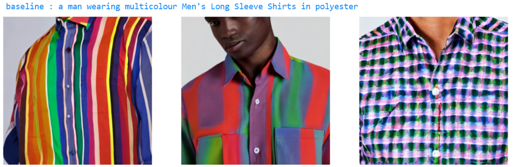
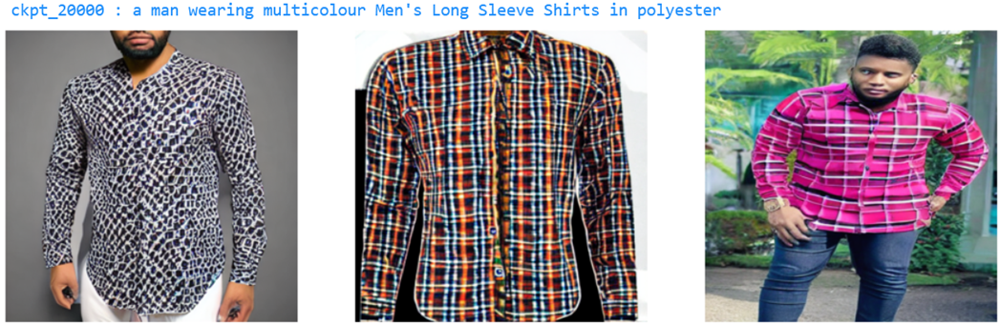
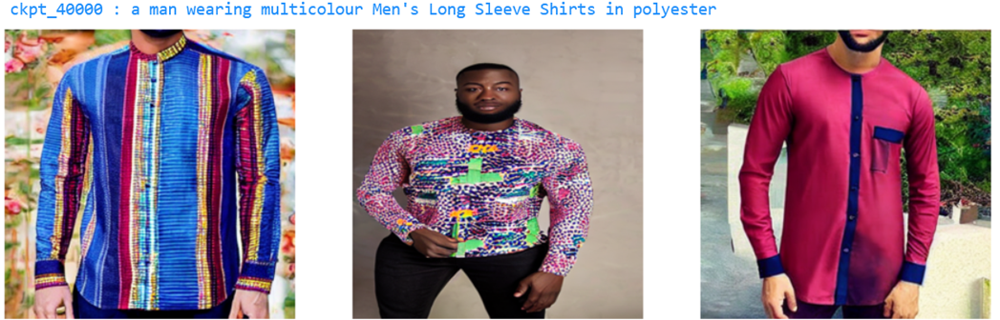
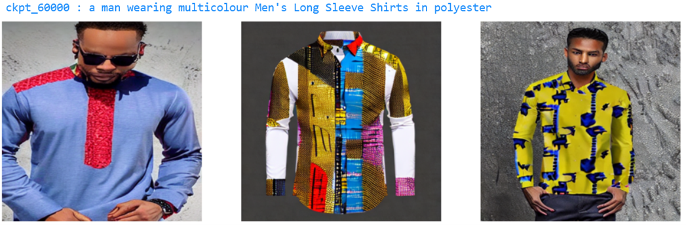
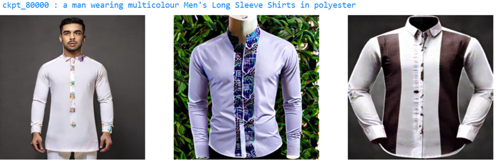
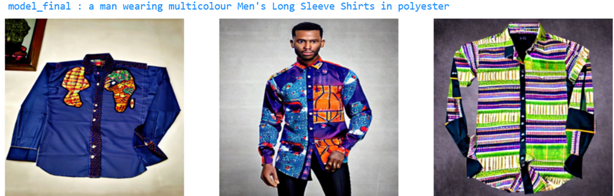

## Limits and future work

The accuracy of the prompt plays a vital role in the model's performance. As a result, future work could focus on refining and improving the prompts to achieve better results. Additionally, it is essential to enhance the quality of the images generated by the fine-tuned model.

## Contributions

We are committed to contributing to the AI ecosystem and fostering the development of more inclusive and diverse AI models. We encourage contributions to the project and welcome feedback from the community. If you encounter any issues with the data or models, please feel free to open an issue on this repository.

## Installation

Follow the instructions on the official Huggingface github page : https://github.com/huggingface/diffusers/blob/main/examples/text_to_image/README.md

```bash 
git clone https://github.com/huggingface/diffusers
cd diffusers
pip install .
```

Create a conda environment and install the requirements :
```sh 
pip install -r requirements_pip.txt
```
and
```sh
conda create --name ai4innov_env --file requirements_conda.txt
```
Initialize an `Accelerate` environment with:
```bash 
accelerate config
```
and follow the steps that matches your hardware configuration.

Run the following command to authenticate your `Hugging Face Hub` token:

```bash 
huggingface-cli login
```


## Usage

To reproduce our results, change `path_to_the_checkpoint` and `path_to_dataset` by the correct values. 
```bash
export MODEL_NAME="path_to_the_checkpoint"
export dataset_name="path_to_dataset"

accelerate launch train_text_to_image.py   \
    --pretrained_model_name_or_path=$MODEL_NAME \
    --dataset_name=$dataset_name  \
    --use_ema   \
    --resolution=512 \
    --center_crop \
    --random_flip   \
    --train_batch_size=1   \
    --gradient_accumulation_steps=4  \ 
    --gradient_checkpointing   \
    --mixed_precision="fp16"   \
    --max_train_steps=96000 \
    --checkpointing_steps=20000 \
    --seed=1   \
    --learning_rate=1e-05   \
    --max_grad_norm=1   \
    --lr_scheduler="constant" \
    --lr_warmup_steps=0   \
    --output_dir=sd-ai4innov-model/
```
To simply use our fine tuned model and visualize a comparaison with `Stable Diffusion v1-4`, use this code :
```python
from diffusers import StableDiffusionPipeline
import torch
import matplotlib.pyplot as plt


def display_images(prompts_list:list):                
    list_image1 =  []
    list_image2 =  []
    for prompt in prompts_list:
              ima1 = sdf_1_4(prompt=prompt).images[0]
              list_image1.append(ima1)     
              ima2 = ai4innov_model(prompt=prompt).images[0]
              list_image2.append(ima2)

    plt.rcParams.update({'font.size': 5})
    for i in range(len(prompts_list)):
        plt.figure() ; fig, ax = plt.subplots(1,2)
        ax[0].imshow(list_image1[i])
        ax[0].axis('off')
        ax[0].set_title(f'{prompts_list[i]} (Stable Diffusion 1-4)')
        ax[1].imshow(list_image2[i])
        ax[1].axis('off')
        ax[1].set_title(f'{prompts_list[i]} (Ai4Innov model)')


##Stable Diffusion 1-4
sdf_1_4_path = "CompVis/stable-diffusion-v1-4"
sdf_1_4 = StableDiffusionPipeline.from_pretrained(sdf_1_4_path, torch_dtype=torch.float16)
sdf_1_4.to("cuda")

##Our fine tuned model (checkpoint 20000)
ai4innov_model_path = "sd-ai4innov-model/checkpoint-20000/"
ai4innov_model = StableDiffusionPipeline.from_pretrained(ai4innov_model_path, torch_dtype=torch.float16)
ai4innov_model.to("cuda")

prompts_list = ["a man in ankara wax", "a woman in vlisco with gold earrings"]   
display_images(prompts_list)
```
​
## License

The data and code for this project are released under the `MIT License`. By using this data or code, you agree to abide by the terms of this license.

## Credits

This project was made possible by the partners of Ai4Innov, namely [Oracle for research](https://www.oracle.com/research/) and [Afrikrea](https://www.afrikrea.com/). 
Most of the scripts used for fine-tuning come from the following repository: https://github.com/huggingface/diffusers/tree/main/examples/text_to_image.


We hope this project will help promote more diverse and inclusive AI models for the African fashion industry. We welcome your contributions and support.


## Citation

```bibtex
@misc{hacheme2021neural,
title={Neural Fashion Image Captioning : Accounting for Data Diversity}, 
author={Gilles Hacheme and Noureini Sayouti},
year={2021},
eprint={2106.12154},
archivePrefix={arXiv},
primaryClass={cs.CV}
}
@misc{ai4innov-fashion,
author = {Abdoulaye SAYOUTI SOULEYMANE and Gilles HACHEME and Jean-Eudes AYILO and Nouréini SAYOUTI SOULEYMANE},
title = {Ai4innov: Afro Fashion Stable Diffusion},
year = {2023},
publisher = {GitHub},
journal = {GitHub repository},
}
